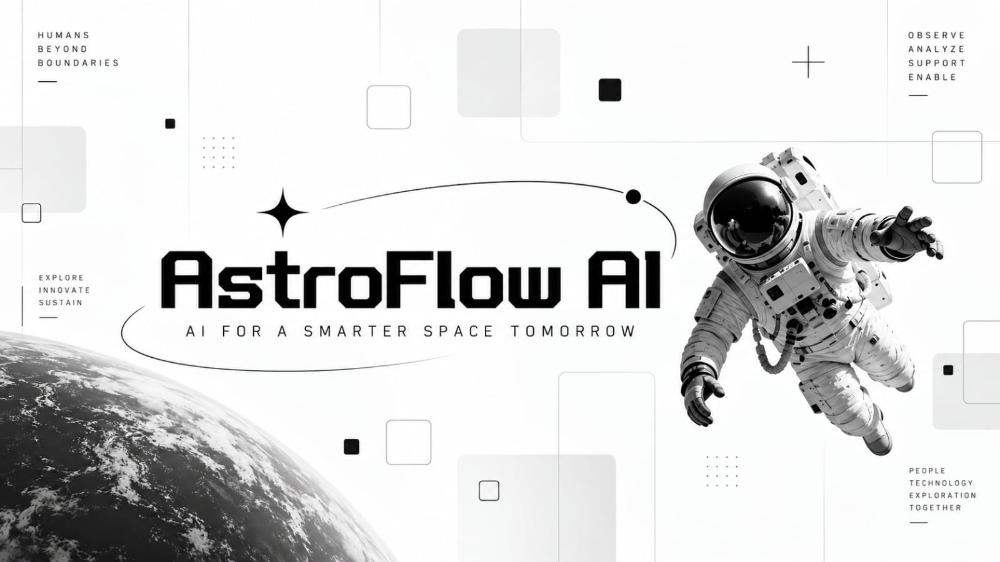
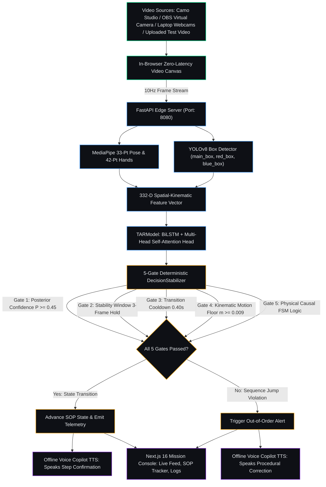
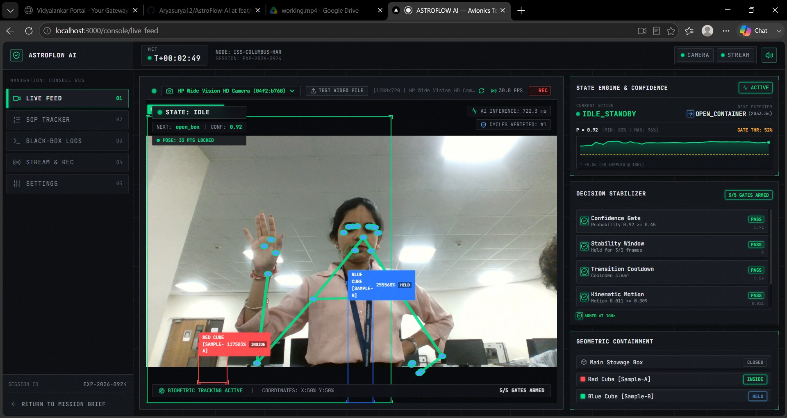
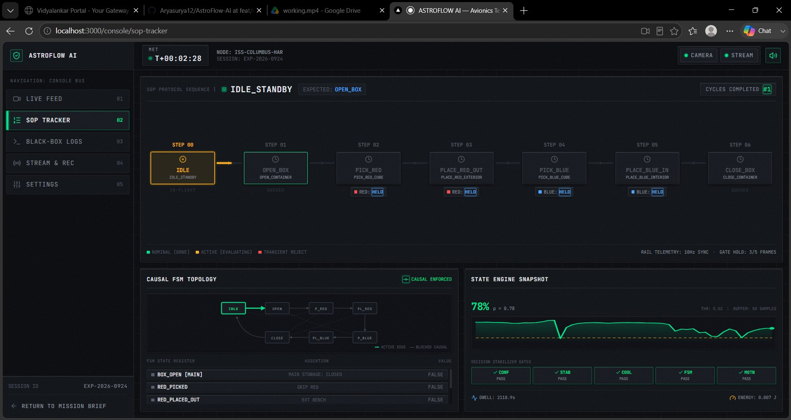
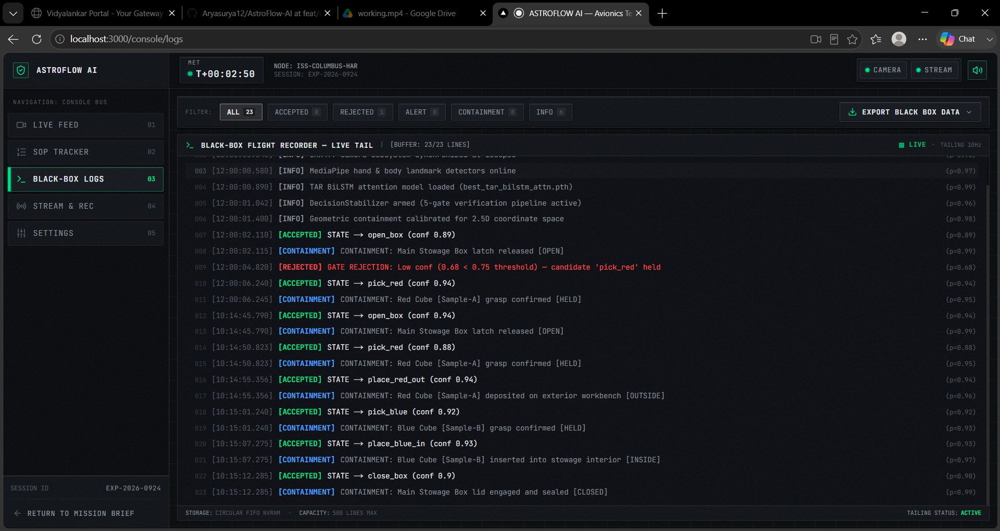
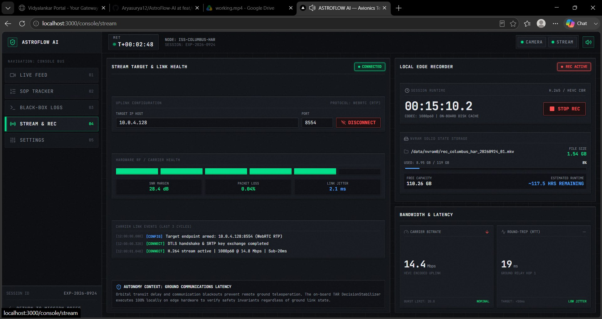

<div align="center">



[](https://github.com/Aryasurya12/AstroFlow-AI)
[](https://github.com/Aryasurya12/AstroFlow-AI)
[](https://github.com/Aryasurya12/AstroFlow-AI)
[](https://github.com/Aryasurya12/AstroFlow-AI)
[](https://github.com/Aryasurya12/AstroFlow-AI)

[](https://nextjs.org/)
[](https://bun.sh/)
[](https://python.org/)
[](https://github.com/Aryasurya12/AstroFlow-AI/stargazers)
[](https://github.com/Aryasurya12/AstroFlow-AI/network/members)
[](https://github.com/Aryasurya12/AstroFlow-AI)

<p align="center">
  <b>Autonomous Real-Time Edge Computer Vision, 5-Gate Decision Stabilization, and Offline Procedural Guidance for Microgravity IVA/EVA Experiment Protocols.</b>
</p>

</div>

---

### [>] System Architecture & Operational Overview

AstroFlow AI is a mission-critical edge AI avionics console built to monitor astronauts performing complex procedural experiment workflows inside gloveboxes and orbital workstations.

Rather than relying on noisy frame-by-frame classifiers, AstroFlow AI integrates deep spatial-temporal neural networks with a deterministic 5-Gate Decision Stabilizer, a 2.5D geometric containment engine, and a 100% offline personal assistant voice copilot that detects protocol skips and speaks aloud to correct mistakes in real time.



---

### [>] Standard Operating Procedure (SOP) Finite State Machine

The platform tracks a sequential 7-stage finite state machine governing container access and sample manipulation:

| Stage | Class Identifier | Canonical Label | Physical Reality Precondition |
| :--- | :--- | :--- | :--- |
| **00** | `idle` | `IDLE_STANDBY` | Operator resting; baseline hands calm |
| **01** | `open_box` | `OPEN_CONTAINER` | Container detected in scene; lid closed prior |
| **02** | `pick_red` | `PICK_RED_CUBE` | Container lid open; red sample located inside |
| **03** | `place_red_out` | `PLACE_RED_EXTERIOR` | Red sample picked; operator deposits to exterior bracket |
| **04** | `pick_blue` | `PICK_BLUE_CUBE` | Red sample confirmed outside; operator retrieves blue sample |
| **05** | `place_blue_in` | `PLACE_BLUE_INTERIOR` | Container open; operator deposits blue sample inside |
| **06** | `close_box` | `CLOSE_CONTAINER` | Red outside; blue inside; operator latches container lid |

```mermaid
stateDiagram-v2
    direction LR
    [*] --> IDLE_STANDBY: Operator Resting
    IDLE_STANDBY --> OPEN_CONTAINER: 01. Open Box
    OPEN_CONTAINER --> PICK_RED_CUBE: 02. Pick Red Sample
    PICK_RED_CUBE --> PLACE_RED_EXTERIOR: 03. Place Red Out
    PLACE_RED_EXTERIOR --> PICK_BLUE_CUBE: 04. Pick Blue Sample
    PICK_BLUE_CUBE --> PLACE_BLUE_INTERIOR: 05. Place Blue Inside
    PLACE_BLUE_INTERIOR --> CLOSE_CONTAINER: 06. Close Container
    CLOSE_CONTAINER --> IDLE_STANDBY: Cycle Complete (+1)
```



---

### [>] The 5-Gate Deterministic DecisionStabilizer

To prevent false transitions caused by frame flicker, microgravity floating limbs, or rapid hand occlusions, raw softmax probabilities must clear five independent hardware-enforced transition gates:

| Gate | Name | Rule & Threshold | Failure Response |
| :--- | :--- | :--- | :--- |
| **Gate 1** | Posterior Confidence | Softmax probability P >= 0.45 (per-class calibrated) | Candidate held in buffer; candidate marked evaluating |
| **Gate 2** | Stability Window | Candidate held across N >= 3 consecutive frames | Suppresses transient single-frame spikes |
| **Gate 3** | Transition Cooldown | Elapsed time >= 0.40s since previous state transition | Blocks rapid double-triggers and mechanical rebound |
| **Gate 4** | Kinematic Motion Floor | Velocity energy m >= 0.009 (calculated from wrist landmarks) | Rejects static hallucinations while operator is resting |
| **Gate 5** | Physical Causal Logic | Evaluates physical preconditions (box must exist, cubes accounted) | Triggers out-of-order warning alert; audio warning sounds |

---

### [>] Screenshots & Avionics Console Demo

<div align="center">

| 01. Live Video Feed & Pose Tracking | 02. SOP Tracker & Causal Directed Graph |
| :---: | :---: |
|  |  |
| *Real-Time Camera Feed, Biometric Pose Skeleton & 5-Gate Telemetry* | *Sequential Flight Plan Strip, Dwell Timers & State Machine Topography* |

| 03. NVRAM Black-Box Flight Recorder | 04. Hardware Settings & Calibration |
| :---: | :---: |
|  |  |
| *Chronological Flight Logs, Multi-Tier Filter & CSV/JSONL Exporter* | *Multi-Camera Source Switcher, Gate Sensitivity Sliders & Model Manifest* |

</div>

---

### [>] Key Features & Capabilities

#### [*] In-Browser Camera & Device Selection
|-- Native `navigator.mediaDevices.getUserMedia()` integration with standard browser permissions (Google Meet / Zoom style).
|-- Automatic enumeration of all connected hardware: Camo Studio, OBS Virtual Camera, Integrated Laptop Cameras, and USB Webcams.
|-- Built-in **[TEST VIDEO FILE]** mode: upload any recorded experiment video (`.mp4`, `.mkv`, `.avi`, `.webm`) to benchmark the AI model on recorded takes with zero physical camera dependencies.

#### [*] Biometric Pose Tracking & Object Detection
|-- MediaPipe 33-point body and 42-point hand landmark tracking with a 6-frame hold smoothing buffer to eliminate visual flickering.
|-- Fine-tuned YOLOv8 bounding box detector locating `main_box` (container), `red_box` (Lotte Choco Pie), and `blue_box` (Cadbury Silk).
|-- Color-accurate UI annotations: Crimson Red (`#FF4D4F`) for Red Cube, Royal Blue (`#2979FF`) for Blue Cube, and Emerald (`#00E08A`) for Container.

#### [*] Offline Voice Copilot (Personal Assistant TTS)
|-- Zero internet or cloud dependencies: operates completely offline on local speaker hardware.
|-- Dual-layer speech architecture: Windows SAPI COM synthesis (`pyttsx3`) combined with browser Web Speech API.
|-- Natural procedural guidance:
    [+] On Verified Step: *"Step 2 verified: Picking red sample cube."*
    [+] On Skipped Step: *"Astronaut, hold on. You missed step 3. Please deposit the red sample cube onto the exterior bracket before proceeding."*

#### [*] Flight Data Recorder & Structured Export
|-- In-memory NVRAM circular buffer recording `[ACCEPTED]`, `[REJECTED]`, `[ALERT]`, and `[CONTAINMENT]` events.
|-- One-click structured export downloading verified flight logs in `.csv` and `.jsonl` formats for mission debriefing.

---

### [>] Prerequisites

Ensure the following runtimes are installed on your host system:

| Dependency | Minimum Version | Recommended | Purpose |
| :--- | :--- | :--- | :--- |
| **Bun** | `v1.1.0+` | `v1.3.9` | High-performance JavaScript bundler & package manager |
| **Python** | `3.10.x` | `3.10.11` | Required for PyTorch, MediaPipe 0.10.14, and OpenCV |
| **Git** | `2.30+` | Latest | Branch tracking & remote synchronization |
| **Docker** *(Optional)* | `v20.10+` | Latest | Isolated container deployment |

---

### [>] Clean Installation & Setup Guide

#### Step 1: Clone Repository
```bash
git clone https://github.com/Aryasurya12/AstroFlow-AI.git
cd AstroFlow-AI
git checkout feat/edge-ai-vision-integration
```

#### Step 2: Clear Stale NPM Packages & Initialize Bun
If you previously installed dependencies using `npm` or have an existing `node_modules` directory, clear it to prevent lockfile conflicts:
```bash
# Windows (PowerShell)
Remove-Item -Recurse -Force node_modules, package-lock.json -ErrorAction SilentlyContinue
bun install

# Linux / macOS
rm -rf node_modules package-lock.json
bun install
```

#### Step 3: Configure Python 3.10 Virtual Environment
```bash
# Windows (PowerShell)
py -3.10 -m venv .venv
.\.venv\Scripts\python.exe -m pip install --upgrade pip
.\.venv\Scripts\python.exe -m pip install "numpy>=1.24.0,<2.0.0" "mediapipe==0.10.14" "opencv-python>=4.8.0" "ultralytics>=8.0.0" "torch" "torchvision" "fastapi" "uvicorn[standard]" "websockets" "pyttsx3" "pygrabber" "python-multipart" "requests"

# Linux / macOS
python3.10 -m venv .venv
source .venv/bin/activate
pip install --upgrade pip
pip install "numpy>=1.24.0,<2.0.0" "mediapipe==0.10.14" "opencv-python-headless>=4.8.0" "ultralytics>=8.0.0" "torch" "torchvision" "fastapi" "uvicorn[standard]" "websockets" "pyttsx3" "python-multipart" "requests"
```

---

### [>] How to Run (3 Fallback Execution Modes)

#### Method A: Unified Launcher (Recommended - One Command)
Boots both the Next.js Mission Console (Port 3000) and the Python FastAPI Edge Server (Port 8080) concurrently with unified logging and synchronized shutdown:
```bash
bun run dev:all
```

#### Method B: Individual Service Launch (Manual Terminals)
Run the services independently across two separate terminal sessions:

**Terminal 1 (FastAPI AI Edge Server):**
```bash
# Windows (PowerShell)
.\.venv\Scripts\python.exe -m uvicorn ai_engine.server:app --host 0.0.0.0 --port 8080

# Linux / macOS
source .venv/bin/activate
python -m uvicorn ai_engine.server:app --host 0.0.0.0 --port 8080
```

**Terminal 2 (Next.js Mission Console):**
```bash
bun run dev
```

#### Method C: Containerized Deployment (Docker Compose)
Runs the entire stack inside an isolated Docker container with host camera passthrough:
```bash
docker compose up --build
```

---

### [>] Automated Verification Test Suite

Run the automated backend verification test suite covering forward passes, sequential FSM transitions, causal violation rejection, 5-gate stabilization, and camera enumeration:
```bash
bun run test:backend
```

```
======================================================================
Ran 5 tests in 1.042s

[+] test_01_tar_model_forward               ... OK
[+] test_02_causal_logic_nominal_sequence   ... OK
[+] test_03_causal_logic_step_skip_rejection ... OK
[+] test_04_decision_stabilizer_5_gates      ... OK
[+] test_05_camera_enumeration              ... OK

STATUS: ALL BACKEND AUDITS VERIFIED
======================================================================
```

---

### [>] Console URL Reference

| Service / Interface | URL | Protocol | Description |
| :--- | :--- | :--- | :--- |
| **Mission Console Shell** | `http://localhost:3000` | HTTP | Astronaut cockpit overview & diagnostics |
| **01 Live Video Feed** | `http://localhost:3000/console/live-feed` | HTTP | Camera canvas, pose tracking, 5-gate telemetry |
| **02 SOP Tracker** | `http://localhost:3000/console/sop-tracker` | HTTP | Causal FSM graph, flight plan strip, dwell timers |
| **03 Black-Box Logs** | `http://localhost:3000/console/logs` | HTTP | Searchable NVRAM flight logs & CSV/JSONL export |
| **04 Stream & Recording** | `http://localhost:3000/console/stream` | HTTP | WebRTC target link gauges, MKV edge recorder |
| **05 Settings & Hardware** | `http://localhost:3000/console/settings` | HTTP | Camera selector, gate tuning sliders, model specs |
| **FastAPI Edge Hub** | `http://localhost:8080/health` | REST JSON | Subsystem hardware diagnostics |
| **Frame Inference Endpoint** | `http://localhost:8080/api/v1/infer` | HTTP POST | Real-time frame inference API |
| **Telemetry WebSocket** | `ws://localhost:8080/ws/telemetry` | WS | 10Hz live state & gate stream |

---

### [>] Project Directory Layout

```
AstroFlow-AI/
|-- ai_engine/                         # Python Computer Vision & Neural Pipeline
|   |-- models/                        # Pre-trained weights
|   |   |-- best_tar_model.pth         # BiLSTM + Attention model weights
|   |   +-- yolo_boxes.pt              # Fine-tuned 3-class YOLOv8 weights
|   |-- camera.py                      # Multi-device camera detection & DirectShow grabber
|   |-- feature_utils.py               # 332-D spatial feature assembly
|   |-- model_def.py                   # PyTorch TARModel definition
|   |-- pipeline.py                    # Inference pipeline runner wrapping realtime.py
|   |-- pose_extract_advanced.py       # MediaPipe Pose & Hands extraction
|   |-- realtime.py                    # Dual-path DecisionStabilizer & Causal FSM
|   |-- server.py                      # FastAPI REST & WebSocket server (Port 8080)
|   +-- tts.py                         # Offline Personal Assistant Voice Copilot
|-- app/                               # Next.js 16 App Router Pages
|   |-- console/                       # Mission Console Sub-Routes
|   |   |-- live-feed/page.tsx         # Live Video Feed HUD
|   |   |-- logs/page.tsx              # Black-Box Flight Terminal
|   |   |-- settings/page.tsx          # Calibration & Camera Controls
|   |   |-- sop-tracker/page.tsx       # Causal FSM Graph & Flight Strip
|   |   +-- stream/page.tsx            # WebRTC Streamer & Local MKV Recorder
|   +-- page.tsx                       # Console Entry Briefing
|-- components/                        # Avionics Component Library
|   |-- live-feed/                     # Video canvas & DecisionStabilizer cards
|   |-- logs/                          # LogTerminal & LogFilterBar
|   |-- settings/                      # GateThresholdTuning & CameraSourcePanel
|   |-- shell/                         # TopBar, Sidebar, MissionClock, BootSequence
|   +-- sop-tracker/                   # FlightPlanStrip & FsmGraphPanel
|-- context/                           # React Telemetry Context Provider
|-- lib/                               # TypeScript Data Models, Audio & Client APIs
|-- scripts/                           # Cross-Platform Runners
|   |-- dev-all.mjs                    # Unified one-command startup orchestrator
|   +-- test-backend.mjs               # Cross-platform test runner
|-- tests/                             # Automated Verification Suite
|   +-- test_backend.py                # Backend unit tests
|-- Dockerfile                         # Production container specification
|-- docker-compose.yml                 # Multi-container orchestration
+-- package.json                       # Project manifests & scripts
```

---

<div align="center">


<p align="center">
  <b>AstroFlow AI — Autonomous Avionics Platform</b><br/>
  Mission Node: ISS-COLUMBUS-HAR | Session: EXP-2026-0924
</p>

</div>
